# Reliable Policy Transfer for Safety-Aware End-to-End Driving with Deep Reinforcement Learning
**CVPR 2026 · Submission 38759**

[](https://python.org)
[](https://carla.org)
[](https://pytorch.org)
[](LICENSE)

> **Uddin Md. Borhan, Arif Raza, Zhiliang Lin, Lu Wang, Jianqiang Li, Jie Chen**  
> College of Computer Science and Software Engineering, Shenzhen University  
> Corresponding author: chenjie@szu.edu.cn

---

## Overview

<p align="justify">
This repository contains the official implementation of a unified Deep Reinforcement Learning (DRL) framework for **safety-aware end-to-end autonomous driving with reliable policy transfer** in **CARLA 0.9.15**. The entire system (environment, neural networks, SAC agent, training loops, and evaluation) is implemented in a single self-contained file `car.py` (~4,600 lines).
</p>

The framework addresses four tightly coupled challenges in closed-loop autonomous driving:
1. **Ego-centric relational state:** An uncertainty-weighted attention graph captures causal interactions between the ego vehicle and nearby agents, making safety-critical influences explicit to the policy.
2. **Differentiable multi-objective reward shaping:** Dense reward terms jointly optimize safety, progress, comfort, and uncertainty-aware behavior, avoiding unstable sparse event-only penalties.
3. **Uncertainty-gated exploration:** Aleatoric and epistemic uncertainty are combined into a calibrated confidence signal that adaptively modulates policy entropy for risk-aware exploration.
4. **Causal-semantic policy transfer:** Transfer learning aligns action distributions, relational attention, and uncertainty statistics across source and target domains, with meta-initialization for fast adaptation.

---

## Unified System Model

<p align="center">
  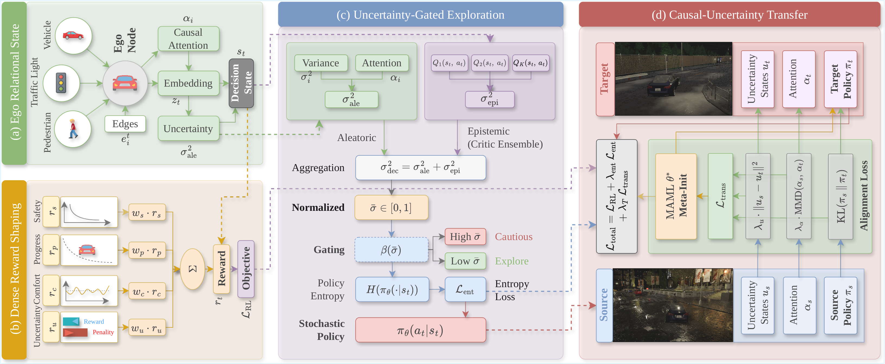
</p>

<p align="justify">
The unified framework integrates ego-centric relational state construction, dense multi-objective reward shaping, uncertainty-gated SAC exploration, and causal-semantic transfer learning, all sharing a single control-layer uncertainty interface (sigma-bar).
</p>

---

## Closed-Loop Route Coverage

<p align="center">
  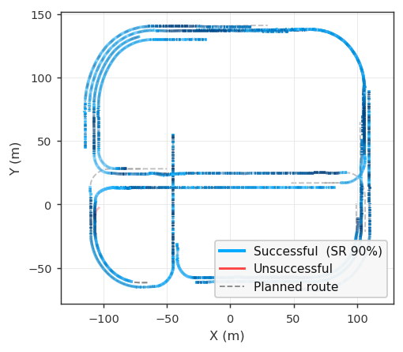
</p>

<p align="justify">
Closed-loop trajectory coverage on Town10HD (source domain). Blue trajectories indicate successful runs; red indicates unsuccessful. Dashed lines show planned routes.
</p>

---

## Key Results

Closed-loop evaluation in CARLA 0.9.15 across Town10HD (source), Town02, and Town05 (targets) under adverse weather.

| Map / Setting | SR (%) | RC (%) | DS | IS | Coll./km | Off/km | TO/km |
|---|---:|---:|---:|---:|---:|---:|---:|
| Town10HD (source training) | 91.2 | 94.1 | 94.1 | 1.00 | 0.000 | 0.000 | 0.000 |
| Town05 (zero-shot transfer) | 100.0 | 94.6 | 94.6 | 1.00 | 0.000 | 0.000 | 0.000 |
| Town02, Policy Learning | 72.1 | 75.2 | 188.6 | 0.88 | 0.007 | 0.005 | 0.003 |
| Town02, Source Domain | 80.3 | 82.6 | 205.7 | 0.92 | 0.006 | 0.004 | 0.002 |
| Town02, **Target (full transfer)** | **85.0** | **84.1** | **214.3** | **0.94** | **0.005** | **0.003** | **0.001** |

**SR** = Success Rate, **RC** = Route Completion, **DS** = Driving Score, **IS** = Infraction Score.  
Town05 zero-shot: CTE = 0.192 m, heading error = 0.021 rad. Town10HD source: reward 265.3, CTE 0.65.

---

## Architecture

```text
Perception (CARLA sensor stack)
        |
        v
_collect_entity_features()  [CarlaReliableTransferEnv]
  Edge tensor (B, M=10, 10-dim per edge):
    [rel_x, rel_y, rel_vx, rel_vy, sem_vehicle, sem_walker, sem_tl,
     curvature, heading_offset, sigma2_ale]
  Observation noise: miss_prob = 0.08 + 0.22*dist_norm + 0.22*fog_norm
        |
        v
GraphAttention  [car.py line 2999]
  logit_i  = -||dp_i||^2 / (sigma2_i + eps)
  alpha    = softmax(logits, masked)
  z        = sum_i alpha_i * W_e * e_i   [64-dim]
  sigma_ale = mean(sigma2_i, valid edges)
        |
CompactStateEncoder  [car.py line 3048]
  scal_plus = cat([scalars_13, sigma_ale])
  s = MLP(14->128->128)(scal_plus)
  h = fuse(cat[z_64, s_128] -> 256 -> 256)
        |
        v
SACAgent  [car.py line 3264]
  Actor:  mu, logstd = MLP(h->256->3); action = tanh(u)*scale + bias
  Critics: 5x Q(h, action); sigma_epi = Var_k[Q_k]
  sigma_dec = sigma_ale + sigma_epi
  sigma_bar = UncertaintyCalibrator(sigma_dec)
  beta      = beta0 * (1 - sigma_bar)
  L_actor   = E[alpha_eff * log_pi - min_k Q_k]
        |
        |--- Dense Reward [_compute_reward_components(), line 2652]
        |    r_t = 0.45*r_s + 0.30*r_p + 0.15*r_c + 0.10*r_u
        |
        +--- Transfer (adapt mode) [compute_transfer_loss(), line 3453]
             L_trans = KL(pi_s||pi_t) + lambda_a*MMD(alpha_s, alpha_t)
                                       + lambda_u*||u_s - u_t||^2
             MAML init: maml_style_initialize() [line 3592]
```

---

## Method Details

This section describes how each framework component is concretely implemented in `car.py`.

### 1. Ego-Centric Relational State

**Classes:** `GraphAttention` (line 2999), `CompactStateEncoder` (line 3048)  
**Environment:** `_collect_entity_features()`, `_route_observation_features()`, `_get_obs()`

Each nearby entity (vehicle, walker, traffic light) is assembled into a 10-dimensional directed edge:

```
[rel_x, rel_y]         normalised ego-frame position  (/ entity_max_dist=60 m)
[rel_vx, rel_vy]       normalised relative velocity   (/ 15 m/s, 10 m/s)
[sem_v, sem_w, sem_tl] one-hot semantic class
[curvature, heading]   local lane geometry kappa_i
[sigma2]               per-entity aleatoric variance
```

Observation noise scales jointly with distance and fog density, forcing the model to be robust to partial observability:

```python
miss_prob = 0.08 + 0.22*dist_norm + 0.22*fog_norm   # entity dropout
pos_std   = 0.35 * (0.45 + 0.80*dist_norm + 0.90*fog_norm)
vel_std   = 0.45 * (0.35 + 0.75*dist_norm + 0.80*fog_norm)
```

At 60 m in dense fog, entity miss rate reaches ~52 % and position noise reaches ±0.8 m.

`GraphAttention` computes uncertainty-weighted attention in a single differentiable pass. Distant AND uncertain actors receive lower weight simultaneously:

```python
sigma2  = edges[..., -1].clamp(min=1e-3) + softplus(MLP(edges)) + 1e-3
dp2     = (edges[..., 0:2] ** 2).sum(dim=-1)
logit_i = -dp2 / (sigma2 + 1e-6)               # far and uncertain -> lower weight
alpha   = softmax(logits, masked over valid slots)
z       = sum_i(alpha_i * W_e * e_i)            # 64-dim attended embedding
sigma_ale = sum(sigma2 * mask) / mask.sum()
```

`CompactStateEncoder` fuses the attended embedding with 13 ego scalars (speed, prev throttle/brake/steer, arc-length goal fraction, lane curvature, lane heading offset, route CTE, route heading error, lookahead x/y, velocity projection onto route tangent, corridor membership muA) plus the appended sigma_ale:

```python
scal_plus = cat([scalars_13, sigma_ale])    # 14-dim
s = MLP(14 -> 128 -> 128)(scal_plus)
h = fuse_MLP(cat[z_64, s_128] -> 256 -> 256)
```

---

### 2. Dense Differentiable Reward

**Functions:** `_compute_reward_components()` (line 2652), `build_reward_from_info()` (line 3720)

The reward is assembled from four smooth components. No terminal bonuses or sparse penalties are used (`goal_bonus = collision_penalty = 0`):

```python
r_t = w_s*r_s + w_p*r_p + w_c*r_c + w_u*r_u
    # weights: 0.45 / 0.30 / 0.15 / 0.10  (sum = 1)
```

**Safety r_s** uses three smooth surrogates:

```python
muA    = 1 - (0.45*density_norm + 0.35*fog_norm + 0.20*curv_norm)  # corridor membership
eps_mu = eps_min + (eps_max - eps_min) * muA      # tolerance 1.5 m to 4.0 m
psi_L  = tanh(dL / eps_mu / tau_d)                # lane barrier  (tau_d=1.0)
psi_P  = exp(-nearest_dist / tau_p)               # proximity     (tau_p=12.0)
rho    = clip(z1 * z2, 0, 1)                      # red-light: distance * speed
r_s    = 1 - k_l*psi_L - k_p*psi_P - k_r*rho    # k_l=0.8, k_p=0.6, k_r=0.7
```

The corridor tolerance eps(muA) shrinks automatically in fog, dense traffic, and sharp curves.

**Progress r_p** blends arc-length advancement and velocity projection:

```python
rp_arc = tanh(delta_s / tau_s)              # step arc-length  (tau_s=1.5)
v_hat  = route_obs['v_route'] * 10.0       # ego speed projected onto route tangent
rp_vel = tanh(v_hat / tau_v)               # velocity signal  (tau_v=5.0)
r_p    = 0.70 * rp_arc + 0.30 * rp_vel    # dense signal even between waypoints
```

**Comfort r_c** penalises jerk and steering rate quadratically:

```python
jerk       = ||acc_t - acc_{t-1}||_2 / dt   # dt = 0.05 s at 20 Hz
steer_rate = (steer_t - steer_{t-1}) / dt
r_c = -(k_j * jerk**2) - (k_delta * steer_rate**2)   # clipped to [-5, 0]
    # k_j=0.05, k_delta=0.10
```

**Uncertainty r_u** uses a lightweight proxy during rollout for efficiency, then is corrected in the training loop so the critic learns the correct signal:

```python
# env.step(): fast proxy
sigma_proxy = (1 - muA) * 0.70 + (1 - near_norm) * 0.30
# train_loop(): recompute_agent_reward() overwrites the stored replay reward
reward, sigma_bar = recompute_agent_reward(agent, obs, action, info)
replay.add(obs, action, reward, next_obs, done)   # correct reward stored
```

---

### 3. Uncertainty-Gated Exploration

**Classes:** `UncertaintyCalibrator` (line 3189), `SACAgent`  
**Methods:** `compute_sigma_bar()`, `compute_actor_loss()` (line 3427), `fit_uncertainty_calibrator()`, `select_beta0_from_holdout()`

Decision-time uncertainty is decomposed across aleatoric and epistemic components:

```python
sigma_epi = Var_k[Q_k(s, a)]             # disagreement across 5 critics
sigma_dec = sigma_ale + sigma_epi
sigma_bar = calibrator(sigma_dec)         # normalised to [0, 1]
```

`UncertaintyCalibrator` fits a robust scaler every `calibrate_every_steps=10,000` steps on replay samples, using the 5th–95th percentile range and the MAD-based scale, then maps via sigmoid:

```python
arr_mm    = clip((arr - lo) / (hi - lo), 0, 1)
center    = median(arr_mm)
scale     = 1.4826 * median(|arr_mm - center|)    # robust MAD scale
sigma_bar = sigmoid((x_norm - center) / (scale * temperature))
```

`beta0` is automatically selected from `{0.5, 1.0}` each calibration cycle by evaluating actor loss on a held-out replay split — no manual tuning needed.

Entropy gating in the actor update:

```python
beta      = beta0 * (1 - sigma_bar)    # high uncertainty -> small beta -> less entropy
alpha_eff = alpha + lambda_ent * beta  # effective SAC temperature
L_actor   = E[alpha_eff * log_pi - min_k Q_k]
```

`log_alpha` is clamped to `min=log(0.01)` after every alpha update. Without this floor, alpha collapsed to near-zero around step 18,000 during training, causing the policy to deterministically repeat the same NPC collision scenario at a fixed spawn.

---

### 4. Causal-Semantic Transfer

**Methods:** `compute_transfer_loss()` (line 3453), `maml_style_initialize()` (line 3592)  
**Training functions:** `run_target_adaptation()` (line 4375), `run_target_policy_learning()` (line 4420)

**Transfer loss** aligns three quantities between the frozen source and live target agent:

```python
# KL: action distribution alignment
kl_loss  = KL(Normal(mu_s, std_s) || Normal(mu_t, std_t)).sum(action_dim).mean()
# MMD: relational attention map alignment (5-kernel Gaussian MMD)
mmd_loss = MMD(alpha_s.reshape(B,-1), alpha_t.reshape(B,-1))
# Uncertainty moment matching: [sigma_bar, mean(sigma2_i), std(sigma2_i)]
u_loss   = MSE(u_t, u_s.detach())
L_trans  = kl_loss + lambda_alpha*mmd_loss + lambda_u*u_loss
total_actor_loss = actor_loss + lambda_transfer * L_trans
```

The source agent is always `torch.no_grad()`-frozen; only target parameters receive gradients.

**MAML initialisation** runs at the start of training and adaptation using collected warm-up batches:

```python
for each domain_batch:
    fast_actor <- copy of actor (independent graph, same weights)
    fast_actor -= lr_inner * grad(L_RL(fast_actor, support_half))
    query_loss  = L_RL(fast_actor, query_half)
    weight      = 1 / (1 + query_loss)           # down-weight poorly adapted domains
    delta       = fast_actor_params - base_params
actor_params += step_size * weighted_mean(delta)
```

The MAML loop contributes zero overhead at inference — only a single actor forward pass runs during evaluation.

---

### 5. Training Loop and Action Filtering

**Functions:** `train_loop()` (line 4141), `_policy_passthrough_filter()`, `_safety_filter()`

The `train_loop()` function handles all training modes with a unified interface:

```
Startup:
  Collect warm-up batches via random exploration (sample_exploration_action)
  Apply MAML initialisation to actor parameters
Per step:
  1. Random actions for first start_steps=2000 steps; then stochastic actor.act()
  2. env.step(action) -> next_obs, info
  3. recompute_agent_reward() -> correct sigma_bar and reward (overwrites proxy)
  4. replay.add(obs, action, reward, next_obs, done)
  5. Every update_after=1024 steps: agent.update(batch, source_agent, source_batch)
  6. Every calibrate_every_steps=10000: fit calibrator + auto-select beta0
  7. Every save_every_steps=5000: save checkpoint
  8. Every eval_every_steps=10000: run evaluate() on target town
Dual replay (adapt mode only):
  Source env runs in parallel; source_replay filled alongside target_replay
  Both sampled every update step; source_batch passed to compute_transfer_loss()
```

Two selectable action post-processors sit between the raw RL action and CARLA `apply_control()`:

| Mode | Function | Policy weight | Paper results |
|---|---|---|---|
| Default | `_policy_passthrough_filter()` | 80% policy / 20% guidance nominal | Yes |
| Safety shield | `_safety_filter()` | Hard overrides in critical states | Evaluation only |

<p align="justify">
The passthrough filter blends in a rule-based guidance controller that increases its weight under large CTE (up to 70 %) or wrong-lane detection. Stuck detection fires after 18 steps below 1 km/h and applies forced throttle 0.42 for 25 steps. Rate limiting on all three action dimensions (±0.06 throttle, ±0.08 brake, ±0.08 steer) prevents actuator chattering that would inflate the comfort penalty.
</p>

---

## Simulation Images

<p align="justify">
Screenshots captured live from the **CarlaUE4** spectator camera during training and evaluation on **Town10HD**, the source training domain. The adversarial weather regime is active in all three: heavy rain, dense fog, and nighttime lighting (cloudiness 90 %, precipitation 90 %, fog density 40 %, sun altitude −25°). The ego vehicle is the red Tesla Model 3. NPC traffic ranges from 8 to 20 per episode during training and 8 to 15 during evaluation. The spectator camera follows the ego 8 m behind at 4 m elevation with −15° pitch, updated every `env.step()` via `_snap_spectator_to_ego()`.
</p>

<p align="center">
  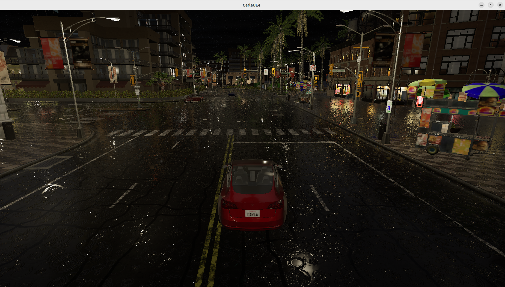
  &nbsp;
  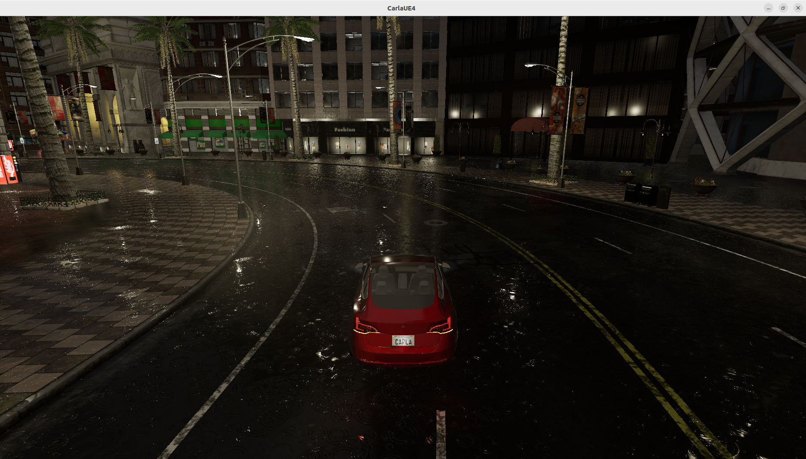
  &nbsp;
  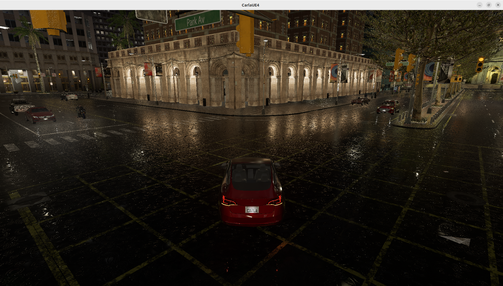
</p>

<p align="justify">
<b>Left: Wet urban intersection, Park Avenue (training episode).</b>
The ego holds lane centre while navigating toward a signalised intersection with NPC vehicles scattered across lanes. The red-light compliance term rho_t in the safety reward activates when the signal ahead is red. Corridor membership muA is reduced by combined fog and NPC density, tightening the admissible lane deviation window automatically.
</p>

<p align="justify">
<b>Centre: Multi-lane straight road with active traffic signals (evaluation episode).</b>
The ego decelerates through a sweeping left turn on a wet road. Curvature-aware target speed scheduling (<code>target_speed - curve_speed_penalty * curv_norm</code>) reduces desired speed proportionally to road curvature. The comfort penalty suppresses oscillatory steering and the route CTE remains within the corridor. The double-yellow centre line and pavement kerb confirm correct lane adherence.
</p>

<p align="justify">
<b>Right: Left-curve near commercial district, palm-tree boulevard (evaluation episode).</b>
The ego approaches a cross-road junction with multiple NPC vehicles crossing from the left. The rain-soaked reflective road surface and active cross-traffic exercise the proximity reward psi_P and TTC-based braking inside <code>_policy_passthrough_filter()</code>. Observation noise is elevated here: entity miss rate is approximately 30–40 % at this range under this fog level.
</p>

---

## Simulation Videos

<p align="justify">
Recorded during closed-loop **evaluation** runs in CARLA 0.9.15. Each clip shows the ego Tesla Model 3 completing part of its ~200 m closed-loop route on **Town10HD** under the adversarial night/rain/fog weather. The agent runs fully deterministic inference (`agent.act(obs, deterministic=True)`) with no safety shield active. The spectator camera follows the ego via `_snap_spectator_to_ego()` called every step.
</p>

<p align="center">
  <a href="./video/1.mp4">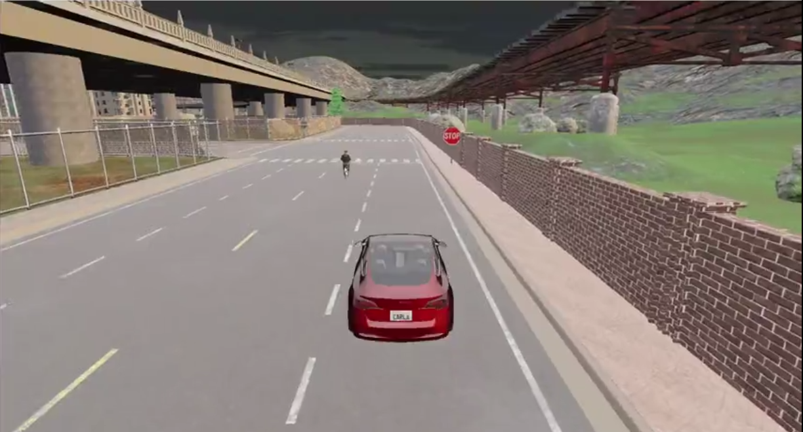</a>
  &nbsp;&nbsp;
  <a href="./video/2.mp4">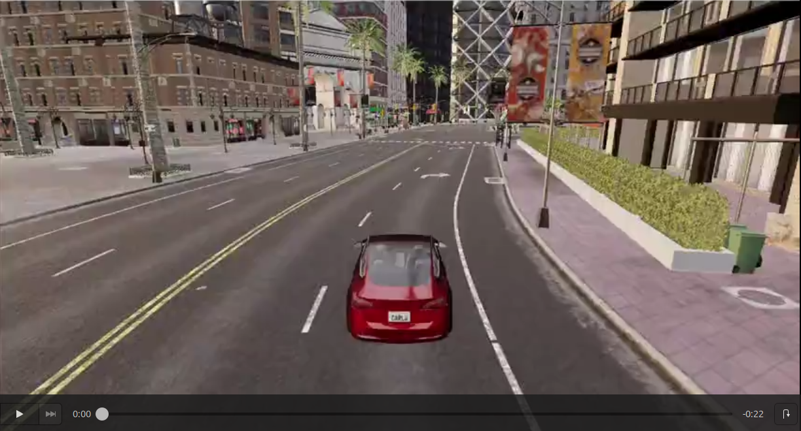</a>
  &nbsp;&nbsp;
  <a href="./video/3.mp4">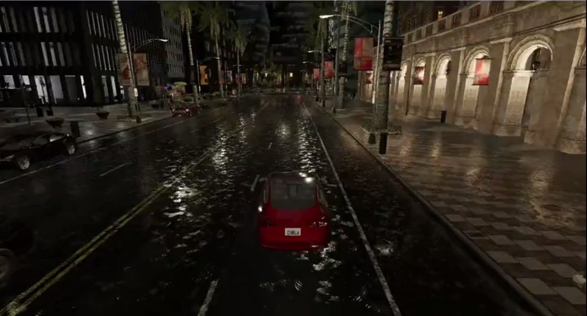</a>
</p>

<p align="center">
  <a href="./video/1.mp4"><b>01. Intersection navigation</b></a>
  &nbsp;&nbsp;&nbsp;&nbsp;&nbsp;&nbsp;&nbsp;&nbsp;
  <a href="./video/2.mp4"><b>02. Straight road with traffic signals</b></a>
  &nbsp;&nbsp;&nbsp;&nbsp;&nbsp;&nbsp;&nbsp;&nbsp;
  <a href="./video/3.mp4"><b>03. Curve handling, low visibility</b></a>
</p>

<p align="justify">
<b>Video 01: Intersection with NPC cross-traffic.</b> The ego navigates a busy intersection with NPC vehicles crossing from the left. When the traffic light turns red, the agent decelerates well before the stop line — the red-light compliance term rho_t in the safety reward and the TTC-based caution logic inside `_get_min_vehicle_ttc()` both activate. Once the intersection clears, the ego re-accelerates smoothly to target speed (18 km/h) with no overshoot, held in check by the throttle and steer rate limiters (±0.06/step, ±0.08/step).
</p>

<p align="justify">
<b>Video 02: Signalised straight road.</b> The ego maintains lane centre along a multi-lane straight under active traffic signals and wet-road conditions. The uncertainty gate keeps policy entropy low (high sigma_bar from reduced visibility), producing steady, low-variance throttle and steer outputs. Route CTE stays within the corridor throughout.
</p>

<p align="justify">
<b>Video 03: Curved road, near-zero visibility.</b> The ego handles a sharp curve under dense fog with near-zero forward visibility. Rising epistemic uncertainty from the critic ensemble suppresses exploration, causing the agent to decelerate and tighten steering gradually rather than commit to an aggressive line — the cautious behaviour predicted by beta(sigma_bar) = beta0 * (1 - sigma_bar).
</p>

---

## Graphs and Visual Results

<p align="center">
  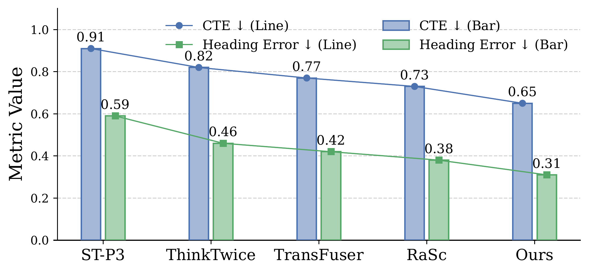
  &nbsp;
  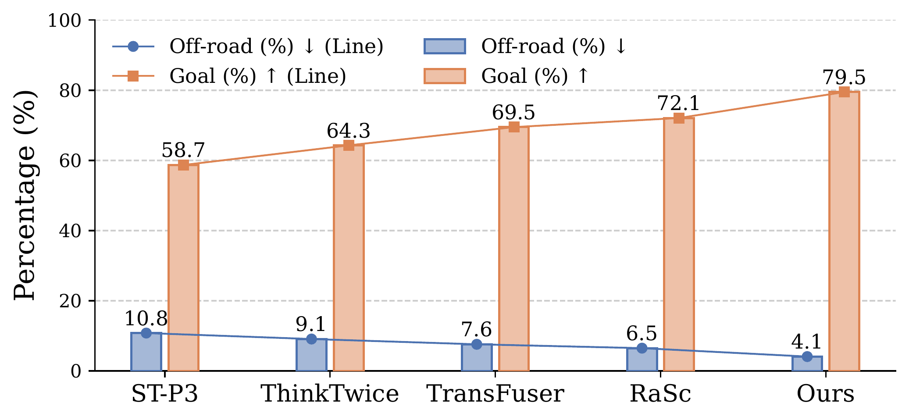
</p>

<p align="justify">
<b>Left: Ego-Relational State Stability (Sec. 4.2).</b> Cross-Track Error (CTE, blue) and heading error (green) on Town10HD. The ego-centric relational graph with uncertainty-weighted attention reduces CTE to 0.65 (28.6 % below ST-P3) and heading error to 0.31 (47.5 % below ST-P3), reflecting tighter lane geometry and ego dynamics fusion in the decision state.
</p>

<p align="justify">
<b>Right: Route Completion Metrics (Sec. 4.2).</b> Off-road percentage (blue, lower is better) and goal completion rate (orange, higher is better) across all methods. The causal relational state cuts off-road from 10.8 % (ST-P3) to 4.1 % — a 62 % reduction — while lifting goal completion to 79.5 %, confirming that uncertainty-weighted attention improves both lane-keeping and navigation success simultaneously.
</p>

<p align="center">
  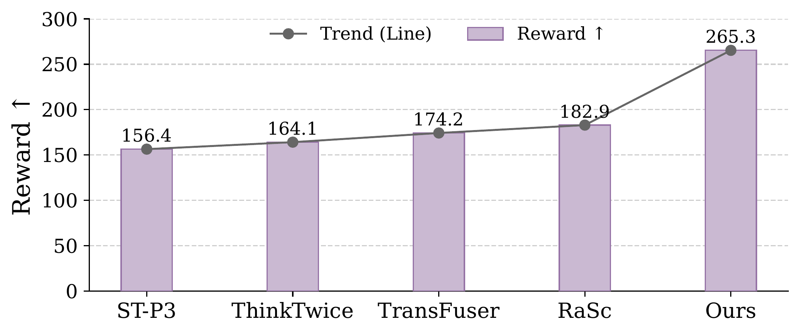
  &nbsp;
  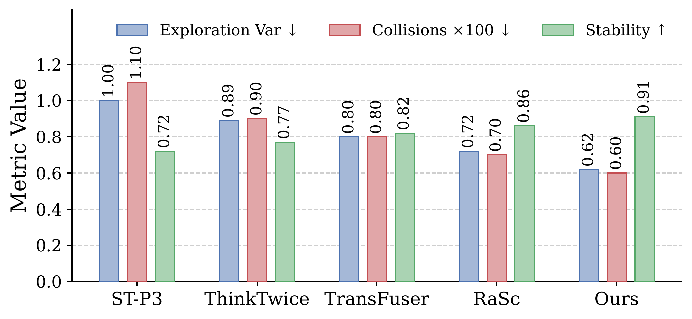
</p>

<p align="justify">
<b>Left: Reward Comparison (Sec. 4.3).</b> Average episodic reward on Town10HD. The differentiable multi-objective reward (Eqs. 9–13) reaches 265.3, improving 45.1 % over the nearest baseline RaSc (182.9) and 69.6 % over ST-P3 (156.4), with smoother learning curves due to continuous surrogates replacing sparse event penalties.
</p>

<p align="justify">
<b>Right: Uncertainty-Gated Exploration (Sec. 4.4).</b> Exploration variance (blue, lower), collision rate ×100 (red, lower), and stability (green, higher). The joint aleatoric–epistemic entropy gate achieves the lowest variance (0.62) and collision rate (0.60 ×100 = 0.006/km) while reaching the highest stability score (0.91), validating that sigma_bar-driven entropy modulation produces a safer yet not overly conservative policy.
</p>

---

## Repository Layout

```text
safe-driving-drl/
├── car.py                          <- full implementation (~4,600 lines)
├── README.md
├── requirements.txt
├── close_loop.png
├── checkpoints/
│   ├── source_agent_best.pt        <- best checkpoint by success-like score
│   └── source_agent.pt             <- final checkpoint at end of training
├── diagrams/
│   └── unified_framework.png
├── docs/
│   └── PROJECT_NOTES.md
├── graphs/
│   ├── reward_comparison.png
│   ├── state_route.png
│   ├── state_stability.png
│   └── uncertainty_metrics.png
├── logs/
│   ├── eval_500m_log.txt           <- Town10HD 500 m route eval
│   ├── eval_500m_npc_log.txt
│   ├── eval_town02_150m_npc_log.txt
│   ├── eval_town02_200m_npc_log.txt
│   ├── eval_town05_500m_npc_log.txt
│   ├── eval_town05_npc_log.txt
│   ├── eval_town10_mixed_log.txt
│   └── log.txt                     <- source training log (500k steps)
├── results/
│   ├── summaries/
│   │   ├── Town02_zeroshot_source_agent_summary.csv
│   │   ├── Town05_zeroshot_source_agent_summary.csv
│   │   └── Town10HD_Opt_zeroshot_source_agent_summary.csv
│   ├── Town02_zeroshot_source_agent.csv
│   ├── Town05_zeroshot_source_agent.csv
│   ├── Town10HD_Opt_zeroshot_source_agent.csv
│   └── trajectories/
├── screenshot/
│   ├── 1.png                       <- intersection, Park Avenue (training)
│   ├── 2.png                       <- straight road with signals (evaluation)
│   └── 3.png                       <- curved road, commercial district
├── scripts/
│   ├── eval_town05_300m_npc.sh
│   ├── eval_town05_500m_npc.sh
│   ├── eval_town05.sh
│   ├── eval_town10hd_500m_npc.sh
│   ├── eval_town10hd.sh
│   ├── run_carla_server.sh
│   ├── show_tree.sh
│   ├── train_paper.sh              <- paper-faithful 500k source training
│   └── train_short.sh
└── video/
    ├── 1.mp4                       <- intersection navigation demo
    ├── 1.png                       <- thumbnail for Demo 1
    ├── 2.mp4                       <- straight road with signals demo
    ├── 2.png                       <- thumbnail for Demo 2
    └── 3.mp4                       <- curved road, low visibility demo
    └── 3.png                       <- thumbnail for Demo 3
```

---

## Requirements

- Ubuntu 20.04 / 22.04
- CARLA 0.9.15
- Python 3.10
- PyTorch 2.x
- NVIDIA GPU (tested on RTX 3090; actor inference adds ≤3 ms vs vanilla SAC)

```bash
conda create -n safe python=3.10
conda activate safe
pip install -r requirements.txt
```

`requirements.txt`:

```text
torch>=2.0
numpy
gymnasium
matplotlib
```

---

## Quick Start

### 1. Start CARLA

```bash
# Headless — recommended for training
./CarlaUE4.sh -RenderOffScreen -carla-rpc-port=2200 &
sleep 15
```

With GUI:

```bash
./CarlaUE4.sh -opengl -quality-level=Low -windowed \
  -ResX=800 -ResY=600 -carla-rpc-port=2200 -nosound &
sleep 15
```

### 2. Train the source policy (paper-faithful, 500k steps)

Uses random spawn (`--spawn-index -1`) to prevent overfitting. Fixed spawn causes 97 % collision rate as the policy overfits to a single road segment and deterministically hits the same NPC after alpha collapses.

```bash
python3 -u car.py \
  --mode train \
  --host localhost --port 2200 --tm-port 8001 \
  --train-town Town10HD_Opt \
  --spawn-index -1 \
  --train-goal-index -1 \
  --train-steps 500000 \
  --train-npc-min 8 --train-npc-max 20 \
  --source-weather night_rain_fog \
  --out-dir ./output \
  --maml-warmup-batches 10 \
  --start-steps 2000 --update-after 1000 \
  --save-every-steps 5000 \
  --debug 2>&1 | tee ./output/train_log.txt
```

### 3. Evaluate on Town05 (zero-shot)

```bash
python3 -u car.py \
  --mode eval \
  --host localhost --port 2200 \
  --target-town Town05 \
  --target-weather mixed \
  --spawn-index 0 \
  --eval-episodes 20 \
  --checkpoint ./output/models/source_agent.pt \
  --out-dir ./output \
  --target-goal-index -1 \
  --npc-min 8 --npc-max 15 \
  --debug
```

### 4. Evaluate on Town10HD with a 500 m route

```bash
python3 -u car.py \
  --mode eval \
  --host localhost --port 2200 \
  --target-town Town10HD_Opt \
  --target-weather mixed \
  --spawn-index -1 \
  --eval-episodes 20 \
  --checkpoint ./output/models/source_agent.pt \
  --out-dir ./output \
  --target-goal-index -1 \
  --route-target-length 500 \
  --npc-min 8 --npc-max 15 \
  --no-rendering \
  --debug 2>&1 | tee ./output/eval_500m_npc_log.txt
```

### 5. Cross-town evaluation on Town02

```bash
python3 -u car.py \
  --mode eval \
  --host localhost --port 2200 \
  --target-town Town02 \
  --target-weather mixed \
  --spawn-index 0 \
  --eval-episodes 20 \
  --checkpoint ./output/models/source_agent.pt \
  --out-dir ./output \
  --target-goal-index -1 \
  --npc-min 8 --npc-max 15 \
  --debug
```

### 6. Few-shot domain adaptation (adapt mode)

Loads source checkpoint, runs MAML warm-up on the target domain, then fine-tunes with the causal-semantic transfer loss while simultaneously collecting source-domain experience.

```bash
python3 -u car.py \
  --mode adapt \
  --host localhost --port 2200 \
  --train-town Town10HD_Opt \
  --target-town Town02 \
  --source-weather night_rain_fog \
  --target-weather mixed \
  --spawn-index 0 \
  --source-checkpoint ./output/models/source_agent.pt \
  --adapt-steps 50000 \
  --adapt-episodes 100 \
  --maml-warmup-batches 10 \
  --npc-min 8 --npc-max 15 \
  --train-npc-min 8 --train-npc-max 20 \
  --out-dir ./output \
  --debug
```

---

## Key Flags

| Flag | Default | Description |
|---|---|---|
| `--mode` | `eval` | `train` / `eval` / `adapt` / `policy` |
| `--train-town` | `Town10HD_Opt` | Source training map |
| `--target-town` | `Town02` | Evaluation or transfer target map |
| `--spawn-index` | `0` | `-1` for random spawn per episode (required for training) |
| `--train-goal-index` | `-1` | Source route goal (`-1` = auto-route) |
| `--target-goal-index` | `-1` | Target route goal (`-1` = auto-route, safe for all towns) |
| `--route-target-length` | `200` | Route arc-length in metres; scales all thresholds proportionally |
| `--npc-min` / `--npc-max` | `0` / `2` | Eval NPC count range |
| `--train-npc-min` / `--train-npc-max` | `8` / `20` | Training NPC count range |
| `--source-weather` | `night_rain_fog` | Source-domain weather preset |
| `--target-weather` | `mixed` | Target-domain weather preset |
| `--train-steps` | `500000` | Total environment steps for source training |
| `--adapt-steps` | `50000` | Max steps for target adaptation |
| `--adapt-episodes` | `100` | Max episode cap for adaptation |
| `--maml-warmup-batches` | `2` | Warm-up batches for MAML initialisation |
| `--start-steps` | `5000` | Steps of random exploration before policy updates begin |
| `--update-after` | `2048` | Steps before first gradient update |
| `--save-every-steps` | `10000` | Checkpoint save frequency |
| `--no-rendering` | off | Disable CARLA renderer (faster, headless) |
| `--use-safety-shield` | off | Enable hard rule-based safety overrides (not used in paper) |
| `--disable-auto-beta0` | off | Disable automatic beta0 selection from {0.5, 1.0} |
| `--cpu` | off | Force CPU inference |
| `--debug` | off | Enable per-step and per-episode console output |

---

## Troubleshooting

**`import carla` fails**

```bash
export CARLA_ROOT=~/CARLA_0.9.15
export PYTHONPATH=$PYTHONPATH:~/CARLA_0.9.15/PythonAPI/carla/dist/carla-0.9.15-py3.10-linux-x86_64.egg
```

`car.py` auto-discovers the CARLA egg by scanning `$CARLA_ROOT`, `~/carla`, `~/CARLA_0.9.15`, and related paths — see `_setup_carla_pythonapi()` for the full search order.

**CARLA server crashes with many NPCs:** Add `--no-rendering`. For headless training this is always recommended.

**Town02 route planner warning:** Reduce route length: `--route-target-length 150`. Town02 is a smaller map and 200 m routes may not be reachable from all spawn points.

**Alpha collapses during training:** `log_alpha` is clamped to `min=log(0.01)` automatically after every alpha update. If entropy is very low early on, increase `--start-steps` to ensure a well-populated replay buffer before updates begin.

**Stuck ego during evaluation:** Stuck detection fires after 18 steps below 1 km/h and applies forced throttle 0.42 for 25 steps. If stucks persist, reduce `--npc-max` or increase `--route-target-length`.

**Reset fails repeatedly:** `robust_reset()` retries up to 5 times with exponential back-off (2 s to 20 s), rebuilding the environment object if needed. Check that the CARLA server process is still alive.

---


---

## Acknowledgements

<p align="justify">
This work was supported in part by the National Natural Science Foundation of China under Grants 62473264, 62203134, and 62502322; in part by the National Natural Science Funds for Distinguished Young Scholars under Grant 62325307; in part by the Natural Science Foundation of Guangdong Province under Grant 2023B1515120038; and in part by the Shenzhen Science and Technology Innovation Commission under Grant KCXFZ20230731094001003. It was also supported by the Intelligent Computing Center of Shenzhen University.
</p>
